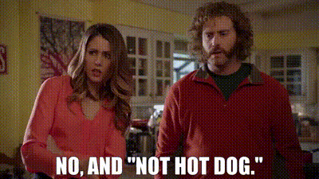
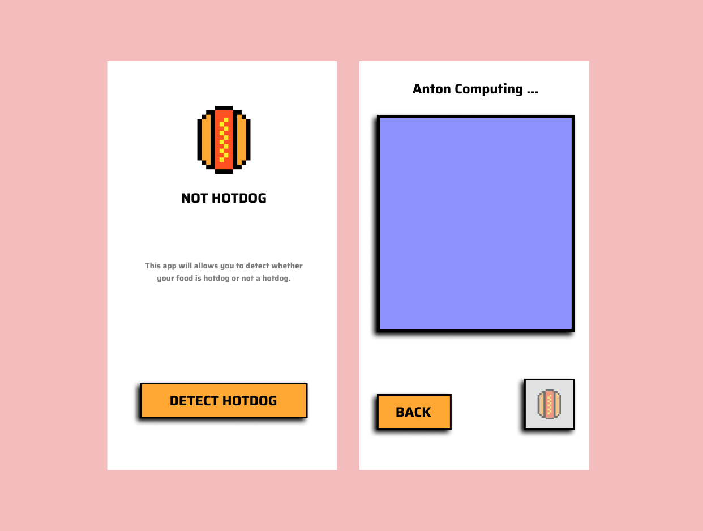

# 🌭 Not Hotdog: The Ultimate Food Classifier 🌭

Inspired by Jian-Yang's groundbreaking "SeeFood" app from HBO's Silicon Valley, this project aims to solve one of the most pressing issues of our time: Is it a hotdog or not?



Ever found yourself staring at a mysterious cylindrical object nestled in a bun, questioning the very nature of its existence? Fear not! This cutting-edge AI is here to put your mind at ease. Simply feed it an image, and it will deliver the verdict with confidence.

## 🍔 What's Cookin'?

This project uses a Convolutional Neural Network (CNN) to classify images as either "hotdog" or "not hotdog." I've experimented with both a custom CNN architecture and a fine-tuned ResNet18 model from PyTorch. 

The dataset used for training is sourced from the [hotdog-not-hotdog-dataset](https://github.com/youngsoul/hotdog-not-hotdog-dataset). A big thank you to the creator for compiling this crucial collection of sausage photos!

## 🛠️ Key Dependencies

This project relies on several powerful libraries to bring the hotdog magic to life:

- **Flask**
- **PyTorch**  
- **torchvision** 
- **torchmetrics**
- **numpy** 
- **matplotlib** 


## 🔧 Setting Up The Environment

### 1. Clone the Repository

```bash
git clone https://github.com/vineeshvk/not-hotdog-ml
cd not-hotdog-ml
```

### 2. Create a Virtual Environment

```bash
python -m venv .venv
```
#### Activate the virtual environment:

- On Windows:
    ```
    .venv\Scripts\activate
    ```
- On macOS and Linux:
    ```
    .venv/bin/activate
    ```

### 3. Install Dependencies
```
pip install -r requirements.txt
```
### 4. Fire Up the Grill (Run the Flask Project)
```
python app.py
```


## 🌟 API Routes

### 1. Train the Model
**Route**: `/run_train` \
**Method**: GET \
Run it like this
```
curl http://localhost:5000/run_train
```


### 2. Predict Hotdog
**Route**:`/predict` \
**Method**: POST \
Is it a hotdog? Let's find out:
```
curl -X POST -F "file=@path/food.jpg" http://localhost:5000/predict
```
Response:
```json 
{
    "class": "Not hotdog" | "Hotdog"
}
```

## 🚀 Future Aspects



I plan to develop a mobile application that will bring hotdog classification to the masses. Users will be able to snap photos or upload images from their device, getting instant "hotdog or not" results. It's like having a tiny Jian-Yang in your pocket! 

Remember, in the world of food classification, there are only two types: hotdog and not hotdog. Choose wisely.
